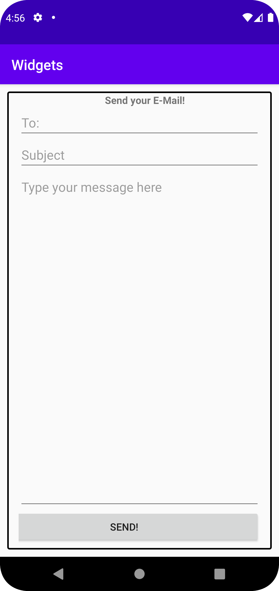

# Rapport

**Rapport Uppgift 3**


Jag har försökt bilda något som liknar en HTML Form, med en textview som heading, och edittext element för inputs.
Detta ger en känsla likt en HTML form och med submit knappen så är allt färdigt för att lägga till funktionalitet om så önskas. 
Jag har även experimenterat med layout spacing och styling element såsom border i XML samt drawable assets.

I denna kod startar jag min linearlayout och ger den spacing för att mitt content ska vara delvis centrerat, och även tillge den sin border.
```
<LinearLayout xmlns:android="http://schemas.android.com/apk/res/android"
    android:layout_width="match_parent"
    android:layout_height="match_parent"
    android:paddingLeft="16dp"
    android:paddingTop="2dp"
    android:paddingRight="16dp"
    android:layout_margin="10dp"
    android:background="@drawable/back"
    android:orientation="vertical" >

```

Sedan använde jag mig av "gravity" attributet för att ge en stor spacing emellan, 
vilket gör att knappen hamnar på botten och messageboxen tar upp all plats den kan.
```
    <EditText
        android:layout_width="match_parent"
        android:layout_height="0dp"
        android:layout_weight="1"
        android:gravity="top"
        android:hint="@string/message" />

    <Button
        android:layout_width="384dp"
        android:layout_height="wrap_content"
        android:layout_gravity="end"
        android:text="@string/send" />
```


 

